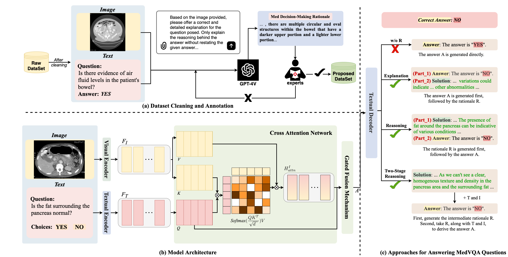

# MedThink: A Rationale-Guided Framework for Explaining Medical Visual Question Answering

This repository contains the official implementation of our NAACL 2025 paper:

> **MedThink: A Rationale-Guided Framework for Explaining Medical Visual Question Answering**  
> Xiaotang Gai, Chenyi Zhou, Jiaxiang Liu, Yang Feng, Jian Wu, Zuozhu Liu  
> *Findings of the Association for Computational Linguistics: NAACL 2025*

[MedThink: Explaining Medical Visual Question Answering via Multimodal Decision-Making Rationale](https://aclanthology.org/2025.findings-naacl.415.pdf)



## 📖 Citation

If you use our work, please cite:

```bibtex
@inproceedings{gai2025medthink,
  title={MedThink: A Rationale-Guided Framework for Explaining Medical Visual Question Answering},
  author={Gai, Xiaotang and Zhou, Chenyi and Liu, Jiaxiang and Feng, Yang and Wu, Jian and Liu, Zuozhu},
  booktitle={Findings of the Association for Computational Linguistics: NAACL 2025},
  pages={7438--7450},
  year={2025}
}
